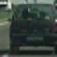
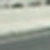
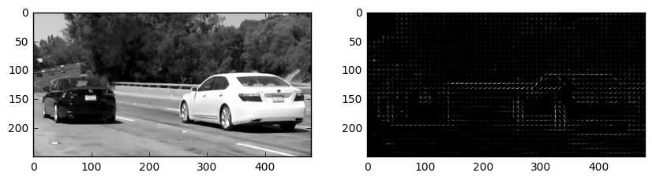
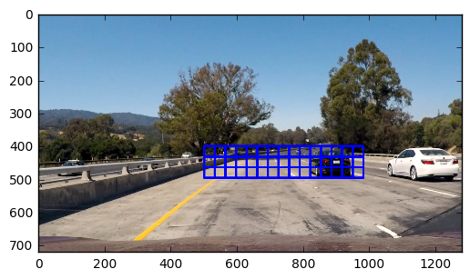
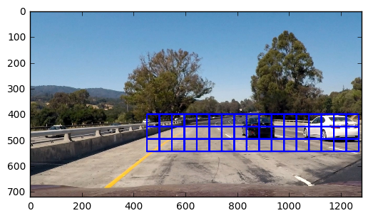
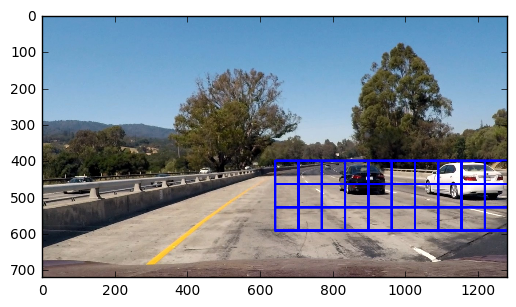
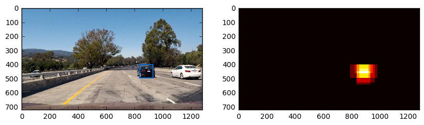

# Vehicle detection

The goal of this project is to develop a pipeline for vehicle detection on the road.

The solution slides through the region of interest of the image and uses pre-trained xgboost model to identify windows where cars appear.

When applied to a video, the solution utilizes historical data to enforce vehicle detection.


This project uses [Advanced Lane Finding Project](https://github.com/alarionov/CarND-Advanced-Lane-Lines) for lane line detection.

Research of the problem can be found in [this notebook](https://github.com/alarionov/CarND-Vehicle-Detection/blob/master/Vehicle%20Detection.ipynb).

[Video result](https://www.youtube.com/watch?v=IDvh9KkcZEM)

## Model Training

The most crucial part of our solution is a model, which will predict if a window contains a car.

For this purpose [XGBoost](http://xgboost.readthedocs.io/en/latest/) was selected since it has a very good reputation for solving classification problems.

### Data

All our images have a size of 64x64 pixels and 3 rgb channels.

```
print(image.shape)
(64, 64, 3)
```

Images are stored in PNG files, so every pixel is a float value in a range from `0` to `1` (during video processing we will work with JPEG images, so we should keep in mind that we need to scale them properly).

All images are split into separate directories for vehicles and nonvehicles.

We will put paths for those files into separate dataset and for each dataset we will set a label: `auto=1` for vehicles and `auto=0` for non vehicles.

Then we will take 8000 images from each dataset and combine it into our final dataset `data`.

```
nonvehicles = pd.DataFrame(glob.glob('data/non-vehicles/*/*.png'), columns=['filename'])
nonvehicles = nonvehicles.sample(8000)
nonvehicles['auto'] = 0

vehicles = pd.DataFrame(glob.glob('data/vehicles/*/*.png'), columns=['filename'])
vehicles = vehicles.sample(8000)
vehicles['auto'] = 1

data = nonvehicles.append(vehicles)
```

Car example             |  Non car example
:----------------------:|:------------------------------:
|

### Feature Extraction

To train our model we will extract following features from every image:

* Histogram of Oriented Gradients
* Color Histogram of RGB image
* Color Histogram of LAB image
* Color Histogram of LUV image
* Color Histogram of HSV image

```
def extract_features(rgb):
    gray = color.rgb2gray(rgb)
    hog_features = hog(gray, feature_vector=True)
    lab = color.rgb2lab(rgb)
    luv = color.rgb2luv(rgb)
    hsv = color.rgb2hsv(rgb)
    rgb_hist_features = color_hist(rgb)
    hsv_hist_features = color_hist(hsv)
    luv_hist_features = color_hist(luv)
    lab_hist_features = color_hist(lab)

    return np.hstack([
            hog_features,
            rgb_hist_features,
            hsv_hist_features,
            lab_hist_features,
            luv_hist_features]).astype(np.float64)
```

#### Histogram of Oriented Gradients

[Histogram of Oriented Gradients (HOG)](https://en.wikipedia.org/wiki/Histogram_of_oriented_gradients) is a feature extraction method which will allow us to catch a structure of a car on the image.
We will use [HOG implemetation from scikit-image package](http://scikit-image.org/docs/dev/auto_examples/plot_hog.html).
The function accepts parameters for `orientations`, `pixels_per_cell` and `cells_per_block`, for our solution default values work just fine though.

```
hog_features = hog(gray, feature_vector=True)
```




#### Color Histogram

We will also use channels from different color schemes to find useful features for vehicle detection.

```
def color_hist(img, nbins=32, bins_range=(0, 256)):
    rhist = np.histogram(img[:,:,0], bins=nbins, range=bins_range)
    ghist = np.histogram(img[:,:,1], bins=nbins, range=bins_range)
    bhist = np.histogram(img[:,:,2], bins=nbins, range=bins_range)

    bin_edges = rhist[1]
    bin_centers = (bin_edges[1:]  + bin_edges[0:len(bin_edges)-1])/2

    hist_features = np.concatenate((rhist[0], ghist[0], bhist[0]))
    return hist_features
```

### Feature Selection

Feature extraction gives us 3300 features. This number of features will significantly increase training time of our model, it also can lead to overfitting and worse performance if we have a lot of useless features in our model.

To decrease the number of features we will remove features with low variance - features, which have very similar values for both vehicles and non vehicles.

```
selector = VarianceThreshold(0.0002)
selector.fit(features)
new_features = selector.transform(features)

print(features.shape)
print(new_features.shape)
(16000, 3300)
(16000, 1471
```

### Feature Scaling

While feature extraction we combined features of different nature, so it's very possible that their scales will be different.

It might cause that our model pays more attention to features of bigger scale. Scaling our features will help us to avoit it.

```
scaler = StandardScaler().fit(features)
scaled_features = scaler.transform(features)
```

### Training

After our data is ready, we can split it into a training set(0.44), a validation set(0.22) and a test set(0.33).

We will use the training set for training the model, the validation set to calculate an error after every round and the test set to calculate the real error for our model after the training.

```
X_training, X_test, y_training, y_test = \
  train_test_split(scaled_features, labels, test_size=0.33, random_state=42)
X_train, X_valid, y_train, y_valid = \
  train_test_split(X_training, y_training, test_size=0.33, random_state=42)

params = {
    'bst:max_depth': 2,
    'bst:eta'      : 1,
    'silent'       : 0,
    'objective'    : 'binary:logistic',
    'nthread'      : 4,
    'eval_metric'  : 'auc'
}

num_round = 80

dtrain = xgb.DMatrix(X_train, y_train)
dvalid = xgb.DMatrix(X_valid, y_valid)
dtest  = xgb.DMatrix(X_test)

evallist  = [(dvalid, 'eval'), (dtrain, 'train')]

bst = xgb.train(params, dtrain, num_round, evallist)
```

## Window sliding

With the trained model we can start analysing images of the road.

Size of vehicles on video images will depend on the relative position of the camera.

Vehicles, which are closer to the camera, will look bigger and vice versa.

To detect vehicels efficiently we will use different sizes of sliding window for differnt regions of the image.

We will use 3 different window sizes: 64x64, 96x96 and 128x128 for 3 different regions of the image.

Since we trained our model on images of size of 64x64, we need to resize a content of our sliding window to the same size.

```
def slide_window(img, x_start_stop=[None, None], y_start_stop=[None, None], xy_window=(64, 64), xy_overlap=(0.5, 0.5)):
    if x_start_stop[0] == None:
        x_start_stop[0] = 0
    if x_start_stop[1] == None:
        x_start_stop[1] = img.shape[1]
    if y_start_stop[0] == None:
        y_start_stop[0] = 0
    if y_start_stop[1] == None:
        y_start_stop[1] = img.shape[0]

    xspan = x_start_stop[1] - x_start_stop[0]
    yspan = y_start_stop[1] - y_start_stop[0]

    nx_pix_per_step = np.int(xy_window[0]*(1 - xy_overlap[0]))
    ny_pix_per_step = np.int(xy_window[1]*(1 - xy_overlap[1]))

    nx_windows = np.int(xspan/nx_pix_per_step) - 1
    ny_windows = np.int(yspan/ny_pix_per_step) - 1

    window_list = []
    images_list = []

    for ys in range(ny_windows):
        for xs in range(nx_windows):
            startx = xs*nx_pix_per_step + x_start_stop[0]
            endx = startx + xy_window[0]
            starty = ys*ny_pix_per_step + y_start_stop[0]
            endy = starty + xy_window[1]

            window_list.append(((startx, starty), (endx, endy)))

            window = np.zeros(xy_window)
            window = img[starty:endy,startx:endx,:]
            window = cv2.resize(window, (64,64))
            images_list.append(extract_features(window))

    return np.array(window_list), np.array(images_list)
```

64x64 window                              | 96x96 window                             | 128x128 window
:----------------------------------------:|:----------------------------------------:|:--------------------------------------------:
||


## Classification

After we get images from regions we are interested in, we combine them into a dataset and use the same feature extraction, feature selection and feature scaling we used for the training data.

Now we are ready to classify every piece of image and predict a probability whether it's a car.

```
window_list1, images_list1 = slide_window(image, [450, None], [400, 550], ( 96,  96), (0.5, 0.5))
window_list2, images_list2 = slide_window(image, [640, None], [400, 600], (128, 128), (0.5, 0.5))
window_list3, images_list3 = slide_window(image, [500, 1000], [400, 500], ( 64,  64), (0.5, 0.5))

window_list = np.concatenate((
				window_list3,
				window_list2,
				window_list1), axis=0)
images_list = np.concatenate((
				images_list3,
				images_list2,
				images_list1), axis=0)

images_list = selector.transform(images_list)
scaled      = X_scaler.transform(images_list)
pred        = bst.predict(xgb.DMatrix(scaled))
```

## Bondaries and Heatmap

With probabilities we calculated above we can add `1` to every pixel of every window which contains a car (probability > 0.5).

```
heatmap = np.zeros(image.shape[0:2])

for prob, pts in zip(pred, window_list):
		x1, y1 = pts[0]
		x2, y2 = pts[1]
		if prob > 0.5:
				heatmap[y1:y2,x1:x2] += 1
```

This way we will create a heatman, which will indicate areas of the image, which contain vehicles.

Now we just need to draw boundary boxes around those regions on the original image.

```
def draw_labeled_bboxes(img, heatmap):
    img_height, img_width = img.shape[0:2]
    labels = label(heatmap)

    for car_number in range(1, labels[1]+1):
        nonzero = (labels[0] == car_number).nonzero()
        nonzeroy = np.array(nonzero[0])
        nonzerox = np.array(nonzero[1])

        bbox = ((np.min(nonzerox), np.min(nonzeroy)), (np.max(nonzerox), np.max(nonzeroy)))
        cv2.rectangle(img, bbox[0], bbox[1], (0,102,204), 6)
    return img
```



## Wrong predictions

Even our model has 99% accuracy on balanced test dataset, sometimes it's not enough.

From time to time our model will detect vehicles where there is none or it won't see a car on the image.

We will use few tricks to make our detection more robust.

* set treshold for a probability very high: 0.99, to include in heatmap only regions, which very likely contain a car

```
if prob > 0.99:
		heatmap[y1:y2,x1:x2] += 1
```

* set treshold for a heatmap to remove regions with a smaller probability of a car

```
def apply_threshold(heatmap, threshold):
    heatmap[heatmap <= threshold] = 0
    return heatmap
```

* use a previous heatmap to enforce detection in regions where a car was detected recently

```
heatmap = cv2.addWeighted(heatmap, 1, previous_heatmap, 0.5, 0)
```

## Conclusion

Though this simple pipeline gives good results already, there is a place for improvement.

### Feature Selection

In addition to filtering near zero variance features, we should consider using [PCA](https://en.wikipedia.org/wiki/Principal_component_analysis) or [LASSO regression](https://en.wikipedia.org/wiki/Lasso_(statistics)).

### Dinamic ROI

In current solution, ROI is fixed and shifted right because the car is driving by left lane with a separator on the left of the car.

To make this solution working on different kind of roads it would be beneficial to detect different types of obstacles and calculate ROI dinamically.

### Deep Learning

It also would be interesting to compare this results to what [Convolutional Neural Network](https://en.wikipedia.org/wiki/Convolutional_neural_network) could do.
